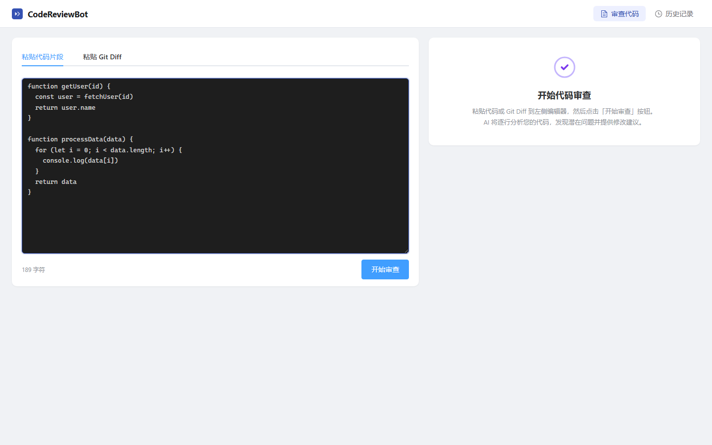
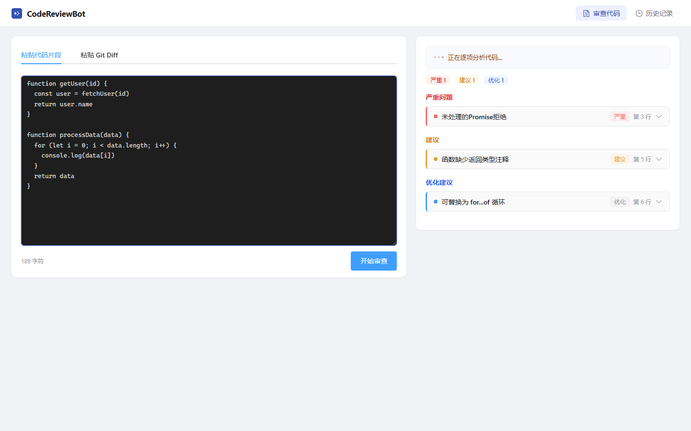
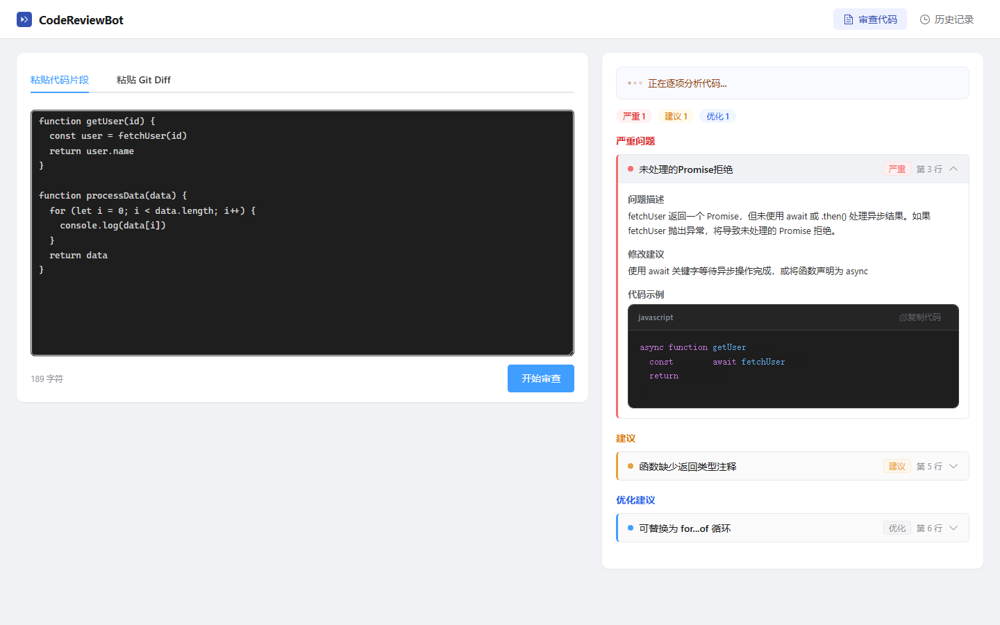
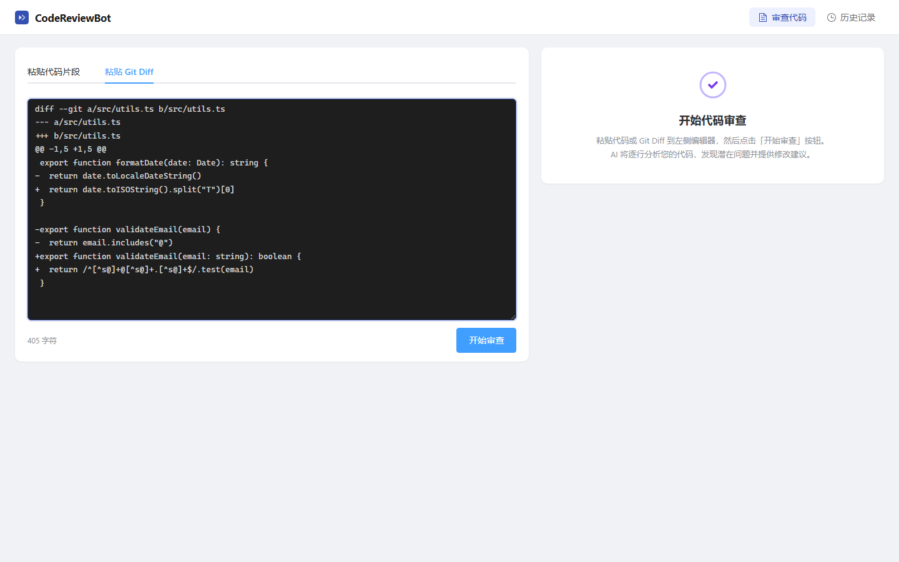
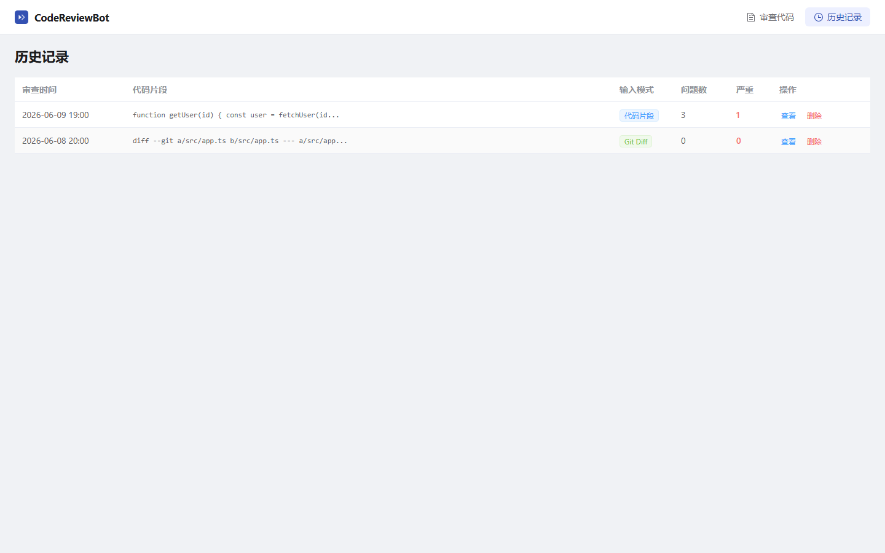
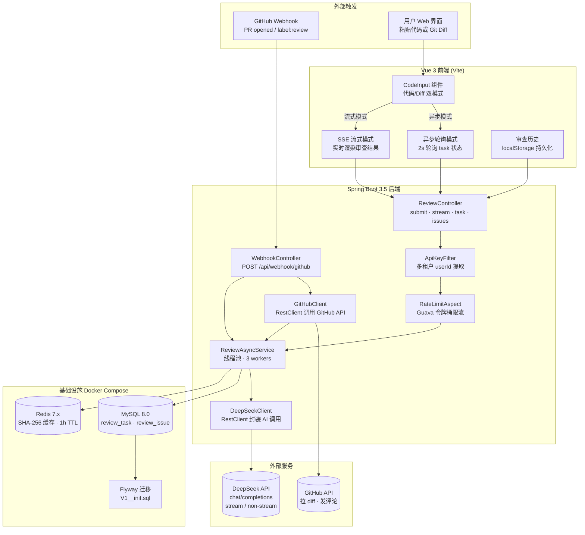

<div align="center">

# 🔍 代码分析服务平台

**后端驱动的 AI 代码审查 — Webhook 自动审查 · 异步架构 · Redis 缓存 · 限流**

[](https://spring.io/)
[](https://openjdk.org/)
[](https://vuejs.org/)
[](https://platform.deepseek.com/)
[](https://www.mysql.com/)
[](https://redis.io/)
[](https://www.docker.com/)
[](https://flywaydb.org/)
[](https://swagger.io/)
[](https://github.com/spider-freedom/code-review-bot/actions)
[](LICENSE)

</div>

---

## 🏛️ 架构亮点（面试重点）

| 特性 | 描述 | 技术 |
|------|------|------|
| 🔗 **GitHub Webhook** | 监听 PR 事件，自动拉 diff → AI 审查 → 回贴行级评论 | `WebhookController` + `GitHubClient` |
| 🔄 **异步审查** | 提交后立即返回 taskId，线程池后台调 AI，前端 2s 轮询 | 线程池 + `review_task` 状态机 |
| ⚡ **结果缓存** | 相同代码 SHA-256 1h 内命中缓存，零 API 消耗 | Redis + SHA-256 |
| 🛡️ **Redis 降级** | 缓存不可用时自动 fallback 直接调 AI，不阻塞业务 | try-catch 双路径 |
| 👥 **多租户隔离** | X-User-Id 请求头提取用户，查询强制带 userId | `ApiKeyFilter` + MyBatis-Plus |
| 🚦 **限流保护** | 单用户 5 次/分钟，Guava 令牌桶算法，超限 HTTP 429 | `@RateLimit` + AOP |
| 🧩 **AI 客户端抽象** | Spring RestClient 统一封装 DeepSeek API，连接池复用 | `DeepSeekClient` |
| 🛑 **全局异常处理** | 9 种异常统一捕获，动态 HTTP 状态码 | `@RestControllerAdvice` |
| 🗄️ **数据库迁移** | Flyway 版本化管理；dev 用 H2 MySQL 模式，prod 用 MySQL | Flyway + H2 + MySQL |
| 🐳 **容器化部署** | Docker Compose 一键启动 MySQL + Redis | `docker compose up -d` |
| 📄 **API 文档** | Swagger UI 在线调试，SpringDoc 自动生成 | OpenAPI 3 / Swagger |

---

## 📸 项目截图

### 代码审查 — 异步提交 + 流式双模式



*左侧粘贴代码或 Git Diff，顶部切换异步提交 / SSE 实时流式*

### 审查结果



*右侧面板实时流式展示结果，按严重程度（错误 / 警告 / 建议）分组*

### 问题详情 — 展开卡片



*点击卡片查看问题描述、修改建议和修复代码示例*

### Git Diff 审查模式



*粘贴 `git diff` 输出进行变更级审查*

### 历史记录 & 详情回看



*审查历史自动保存，支持回看和删除*

---

## ✨ 功能特性

| | 特性 | 说明 |
|------|------|------|
| 🤖 | **AI 智能审查** | DeepSeek 模型，覆盖 Bug / 安全 / 性能 / 规范四维度 |
| 🔗 | **PR 自动审查** | GitHub Webhook 触发，审查结果自动回贴 PR 评论 |
| 🔄 | **异步提交** | 提交后返回 taskId，每 2s 轮询，可离开页面 |
| 📡 | **SSE 流式** | 实时逐条渲染审查结果 |
| ⚡ | **结果缓存** | SHA-256 去重，1h TTL，零 AI 消耗 |
| 🔀 | **双模式输入** | 代码片段 / Git Diff 一键切换 |
| 📊 | **三级分级** | error（红） / warning（黄） / info（蓝） |
| 👥 | **多租户** | 审查历史按用户完全隔离 |
| 🔒 | **隐私优先** | API Key 环境变量注入，不硬编码 |

---

## 🛠️ 技术栈

| 层级 | 技术选型 |
|------|----------|
| **后端** | Spring Boot 3.5 · Java 17 · MyBatis-Plus 3.5.7 · Spring RestClient |
| **数据库** | MySQL 8.0（生产）· H2 MySQL 模式（开发）· Flyway 迁移 |
| **缓存** | Redis 7.x（Lettuce）· SHA-256 去重 key |
| **AI 客户端** | `DeepSeekClient` · REST 非流式 / SSE 流式双模式 |
| **Webhook** | GitHub API · PR diff 拉取 · 审查评论自动回贴 |
| **限流** | Guava RateLimiter · AOP 注解驱动 · per-user 令牌桶 |
| **部署** | Docker Compose（MySQL + Redis）· Graceful Shutdown |
| **文档** | SpringDoc OpenAPI 2.8 · Swagger UI |
| **CI** | GitHub Actions（backend test + frontend build & test） |
| **前端** | Vue 3 · TypeScript · Vite · Element Plus · Pinia · highlight.js |
| **测试** | JUnit 5 + Mockito + AssertJ · Vitest + jsdom |

---

## 📐 系统架构



---

## 🚀 快速启动

### 前置条件

- Java 17+ · Maven 3.8+ · Node.js 18+
- MySQL 8.0 + Redis 7.x（或使用 H2 模式跳过）
- DeepSeek API Key — [获取](https://platform.deepseek.com/api_keys)

### 方式一：MySQL + Redis 全功能（推荐）

```bash
git clone https://github.com/spider-freedom/code-review-bot.git
cd code-review-bot

# 1. 确保 MySQL 和 Redis 在运行，创建数据库
mysql -u root -p -e "CREATE DATABASE IF NOT EXISTS code_review_bot CHARACTER SET utf8mb4;"

# 2. 启动后端
cd code-review-bot-backend
# Windows
set DEEPSEEK_API_KEY=sk-xxxxxxxx
mvn spring-boot:run -Dspring-boot.run.profiles=prod "-Dspring-boot.run.jvmArguments=-Dspring.flyway.enabled=false -Dspring.data.redis.password=你的Redis密码"
# macOS/Linux
export DEEPSEEK_API_KEY=sk-xxxxxxxx
mvn spring-boot:run -Dspring-boot.run.profiles=prod "-Dspring-boot.run.jvmArguments=-Dspring.flyway.enabled=false -Dspring.data.redis.password=你的Redis密码"
# → http://localhost:8080 · Swagger: /swagger-ui.html

# 3. 启动前端（新终端）
cd code-review-bot-frontend
npm install && npm run dev
# → http://localhost:3000
```

### 方式二：H2 快速开发（无需 MySQL/Redis）

```bash
cd code-review-bot-backend
# Windows
set DEEPSEEK_API_KEY=sk-xxxxxxxx
# macOS/Linux
export DEEPSEEK_API_KEY=sk-xxxxxxxx

mvn spring-boot:run
# 使用 H2 嵌入式数据库，数据和缓存均在本地文件
# → http://localhost:8080 · Swagger: /swagger-ui.html
```

---

## 🧪 测试

```bash
# 后端
cd code-review-bot-backend && mvn test

# 前端
cd code-review-bot-frontend && npm test
```

---

## 🚢 部署

```bash
# 前端构建
cd code-review-bot-frontend && npm run build

# 后端打包
cd code-review-bot-backend && mvn clean package -DskipTests

# 生产运行
java -Dspring.profiles.active=prod \
     -DDEEPSEEK_API_KEY=sk-xxxxxxxx \
     -jar target/code-review-bot-1.0.0.jar
```

> 生产需配置 Nginx 反向代理 + SPA fallback + SSE/Webhook 长连接超时。

---

## 📄 License

MIT © 2025 [spider-freedom](https://github.com/spider-freedom)

---

<div align="center">
  <sub>Built with Spring Boot · Vue 3 · MySQL · Redis · DeepSeek AI</sub>
</div>
