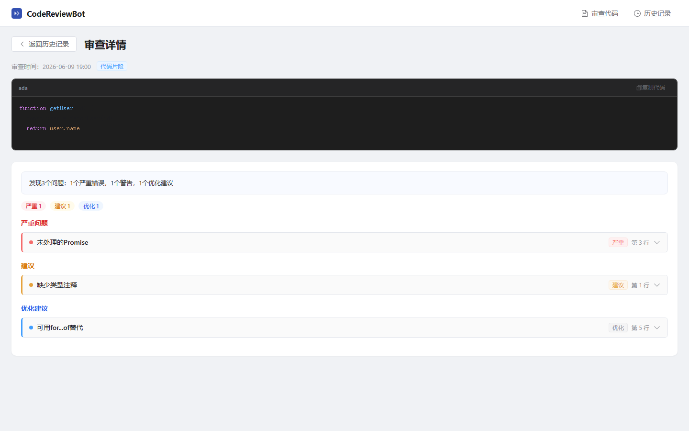

<div align="center">

# 🔍 代码分析服务平台

**后端驱动的 AI 代码审查服务 — 异步架构 · Redis 缓存 · 多租户 · 限流**

[](https://spring.io/)
[](https://openjdk.org/)
[](https://vuejs.org/)
[](https://platform.deepseek.com/)
[](https://www.mysql.com/)
[](https://redis.io/)
[](https://www.docker.com/)
[](https://flywaydb.org/)
[](https://swagger.io/)
[](LICENSE)

</div>

---

## 🏛️ 后端架构亮点（面试重点）

| 特性 | 描述 | 技术实现 |
|------|------|----------|
| 🔗 **GitHub PR 自动审查** | Webhook 监听 PR 事件，自动拉取 diff、审查、回贴评论 | `WebhookController` + `GitHubClient` |
| 🔄 **异步审查架构** | 提交后立即返回 taskId，线程池后台调 AI，结果持久化，前端轮询 | 线程池 + `review_task` 表 |
| ⚡ **结果缓存** | 相同代码 MD5 1h 内命中缓存，跳过 API 调用，减少约 80% 成本 | Redis + MD5 hash |
| 🛡️ **Redis 降级** | 缓存不可用时自动 fallback 到直接调 API，不阻塞业务 | try-catch 双路径 |
| 👥 **多租户隔离** | X-User-Id 请求头提取用户标识，查询强制带 userId 过滤 | `ApiKeyFilter` + LambdaQueryWrapper |
| 🚦 **限流保护** | 单用户每分钟 5 次审查，令牌桶算法，超限 HTTP 429 | `@RateLimit` + AOP + Guava |
| 🛑 **全局异常处理** | 9 种异常统一捕获，动态 HTTP 状态码 | `@RestControllerAdvice` + `ResponseEntity` |
| 🧩 **DeepSeekClient 抽象** | AI API 调用统一封装，Spring RestClient 声明式 HTTP | `RestClient` + `DeepSeekClient` |
| 🗄️ **数据库迁移** | Flyway 版本化 schema 管理，dev(H2 MySQL 模式) / prod(MySQL) | Flyway + H2 + MySQL |
| 🐳 **Docker 部署** | MySQL + Redis 容器化，`docker compose up` 一键启动 | Docker Compose |
| 📄 **API 文档** | Swagger UI 自动生成，`/swagger-ui.html` 在线调试 | SpringDoc OpenAPI 2.8 |
| ⚙️ **工程规范** | HikariCP 连接池 + 优雅停机 + Graceful Shutdown + 线程池 PreDestroy | HikariCP · `@PreDestroy` · Actuator |

---

## 📸 项目截图

### 代码审查 — 异步提交 + 实时流式双模式


*左侧粘贴代码片段或 Git Diff，顶部切换异步提交 / SSE 实时流式模式*

### 审查结果 — 流式渲染


*右侧面板实时流式展示审查结果，按严重程度（严重/建议/优化）分组*

### 问题详情 — 展开卡片


*点击卡片展开查看问题描述、修改建议和修复代码示例*

### Git Diff 审查模式


*切换至「粘贴 Git Diff」模式，直接粘贴 `git diff` 输出进行变更审查*

### 历史记录


*审查历史自动保存在本地，支持查看详情和删除*

### 详情回看



*点击历史记录中的「查看」回顾完整审查结果*

---

## ✨ 功能特性

| 特性 | 说明 |
|------|------|
| 🤖 **AI 智能审查** | DeepSeek 大模型，覆盖 Bug、安全、性能、代码规范四大维度 |
| 🔄 **异步提交模式** | 提交后返回 taskId，每 2s 轮询状态，可离开页面 |
| 📡 **SSE 流式模式** | 实时逐条渲染审查结果，适合快速预览 |
| ⚡ **结果缓存** | 相同代码 1h 内直接返回缓存，零 API 消耗 |
| 🔀 **双模式输入** | 粘贴代码片段 / Git Diff 两种输入 |
| 📊 **三级问题分级** | error（红色）/ warning（黄色）/ info（蓝色）|
| 👥 **多租户隔离** | 不同用户的审查历史和任务互相隔离 |
| 📝 **审查历史** | 自动保存至本地，支持回看和删除 |
| 🔒 **隐私优先** | API Key 环境变量配置，不硬编码 |

---

## 🛠️ 技术栈

| 层级 | 技术 |
|------|------|
| **后端** | Spring Boot 3.5 · Java 17 · MyBatis-Plus 3.5.7 · RestClient · Maven |
| **数据库** | MySQL 8.0（生产）· H2 MySQL 模式（开发）· Flyway 迁移 |
| **缓存** | Redis 7.x（Lettuce）· MD5 去重 key |
| **AI** | DeepSeek API（OpenAI 兼容接口）· `DeepSeekClient` 统一封装 · REST + SSE 双模式 |
| **Webhook** | GitHub API · PR diff 拉取 · 审查结果自动回贴评论 |
| **限流** | Guava RateLimiter · AOP 注解 · per-user 令牌桶 |
| **部署** | Docker Compose（MySQL + Redis）· Graceful Shutdown |
| **文档** | SpringDoc OpenAPI 2.8 · Swagger UI |
| **前端** | Vue 3 · TypeScript · Vite · Element Plus · Pinia |
| **测试** | JUnit 5 + Mockito（8 后端用例）· Vitest（30 前端用例） |

---

## 📐 系统架构

```
                         ┌── GitHub Webhook ──────────────────────────┐
                         │  PR opened / label:review                  │
                         │  POST /api/webhook/github                  │
                         │         ▼                                  │
                         │  ┌──────────────┐   ┌─────────────┐      │
                         │  │ WebhookService│──▶│ GitHub API  │      │
                         │  │ (异步审查)     │   │ (获取 diff)  │      │
                         │  │              │◀──│ (发评论)     │      │
                         │  └──────┬───────┘   └─────────────┘      │
                         │         │                                   │
                         └─────────┼───────────────────────────────────┘
                                   │
                    ┌── SSE 实时流式 (POST /api/review/stream) ──┐
                    │                                              ▼
┌─────────────────┐ │  ┌──────────────────┐    ┌─────────────────┐
│                 │ ┘  │  Spring Boot 3   │───▶│  DeepSeek API   │
│  Vue 3 前端     │    │  SseEmitter      │◀───│  (stream:true)  │
│  (Vite)         │    └──────────────────┘    └─────────────────┘
└─────────────────┘
                    ┌── 异步提交 (POST /api/review/submit) ──┐
                    │                                         ▼
┌─────────────────┐ │  ┌──────────┐  ┌──────────┐  ┌─────────────────┐
│                 │ │  │ MySQL/H2 │  │ 线程池    │  │  DeepSeek API   │
│  Vue 3 前端     │ ┘  │ task 表  │  │ (3 workers│─▶│  (stream:false) │
│  poll /2s       │───▶│ PENDING→ │  │ 异步处理) │◀─│                 │
│                 │◀───│ COMPLETED│  └──────────┘  └─────────────────┘
└─────────────────┘    └────┬─────┘
                            │
           ┌────────────────┼────────────────┐
           │                                  │
    ┌──────┴──────┐                   ┌──────┴──────┐
    │  Redis 缓存  │                   │   Flyway    │
    │  (MD5 去重)  │                   │  DB 迁移    │
    │  1h TTL     │                   │  V1__init   │
    └─────────────┘                   └─────────────┘
```

---

## 🚀 快速启动

### 方式一：Docker Compose（推荐）

```bash
git clone https://github.com/spider-freedom/code-review-bot.git
cd code-review-bot

# 1. 启动基础设施
docker compose up -d
# → MySQL :3306 · Redis :6379

# 2. 配置
cp .env.example .env
# 编辑 .env 填入 DEEPSEEK_API_KEY

# 3. 后端
cd code-review-bot-backend
set DEEPSEEK_API_KEY=sk-xxxxxxxx    # Windows
# export DEEPSEEK_API_KEY=sk-xxx    # macOS/Linux
mvn spring-boot:run
# → http://localhost:8080 · Swagger: /swagger-ui.html

# 4. 前端（新终端）
cd code-review-bot-frontend
npm install && npm run dev
# → http://localhost:3000
```

### 方式二：H2 快速开发（无需 Docker）

```bash
cd code-review-bot-backend
export DEEPSEEK_API_KEY=sk-xxxxxxxx
mvn spring-boot:run
# 使用 H2 文件数据库，无需 MySQL/Redis
```

---

## 🧪 测试

```bash
# 后端（11 用例 — ReviewAsyncService 核心逻辑）
cd code-review-bot-backend && mvn test

# 前端（30 用例 — Store / SSE 解析 / 组件渲染）
cd code-review-bot-fronted && npm test
```

---

## 🚢 部署

```bash
cd code-review-bot-fronted && npm run build
cd code-review-bot-backend && mvn clean package -DskipTests

java -Dspring.profiles.active=prod \
     -DDEEPSEEK_API_KEY=sk-xxxxxxxx \
     -jar target/code-review-bot-1.0.0.jar
```

> 生产部署需配置 Nginx 反向代理 + SPA fallback + SSE 长连接超时。详见 README 原部署章节。

---

## 📄 License

MIT © 2024 [spider-freedom](https://github.com/spider-freedom)

---

<div align="center">
  <sub>Built with Spring Boot, Vue 3, Redis, H2, and DeepSeek AI</sub>
</div>
