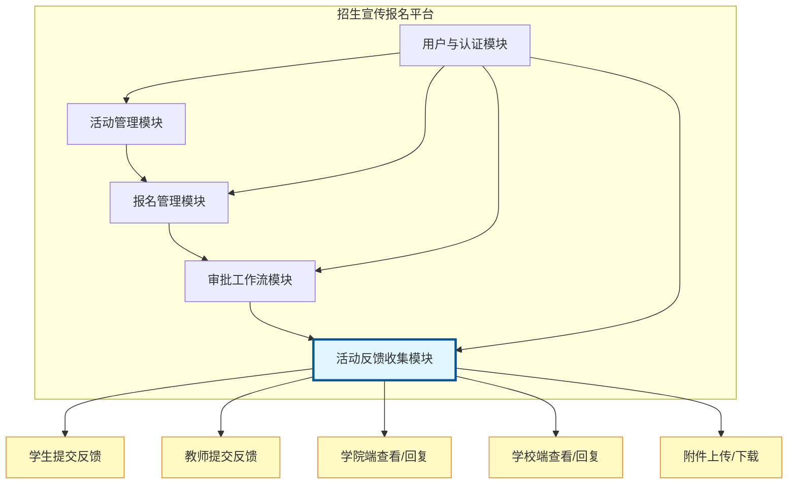
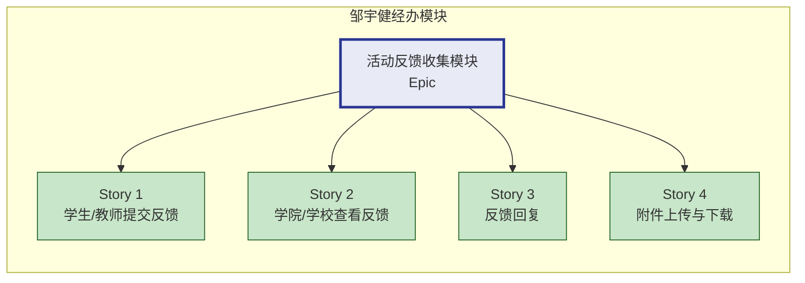
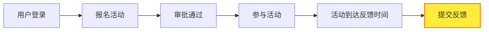
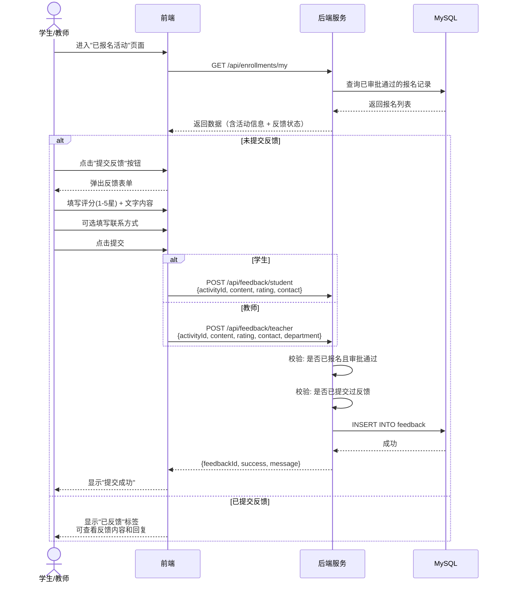
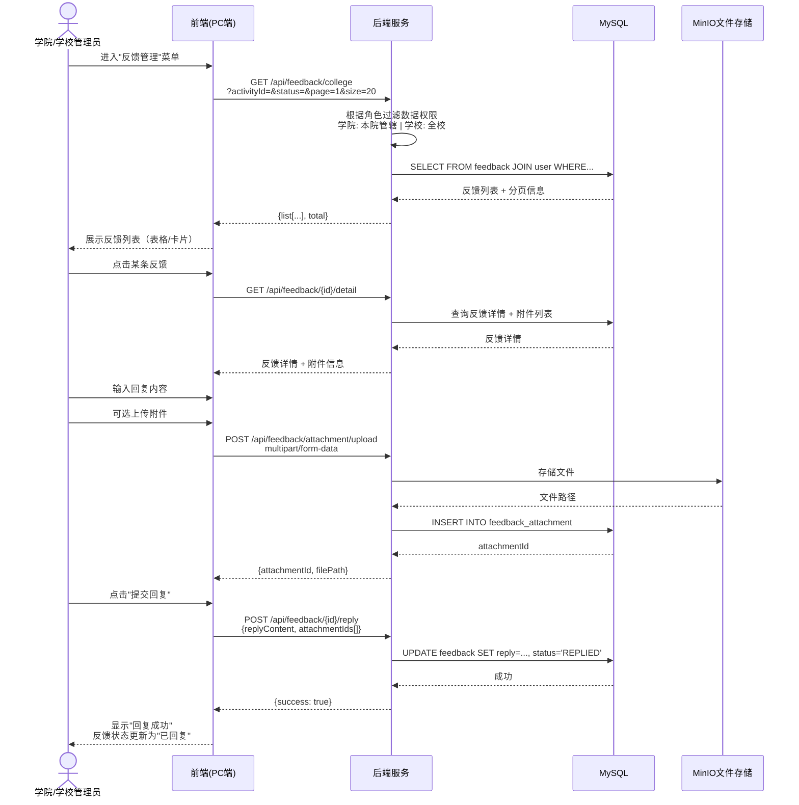
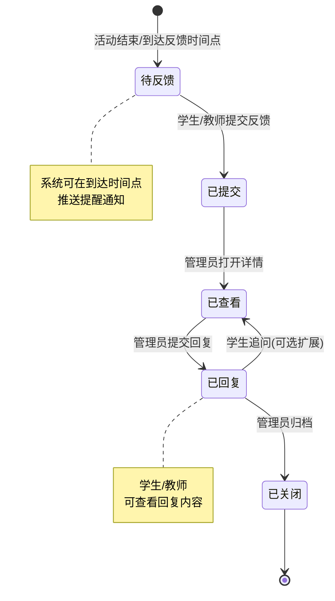
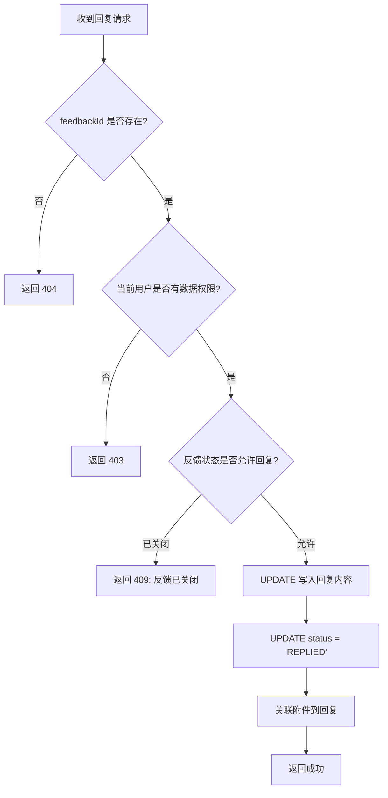
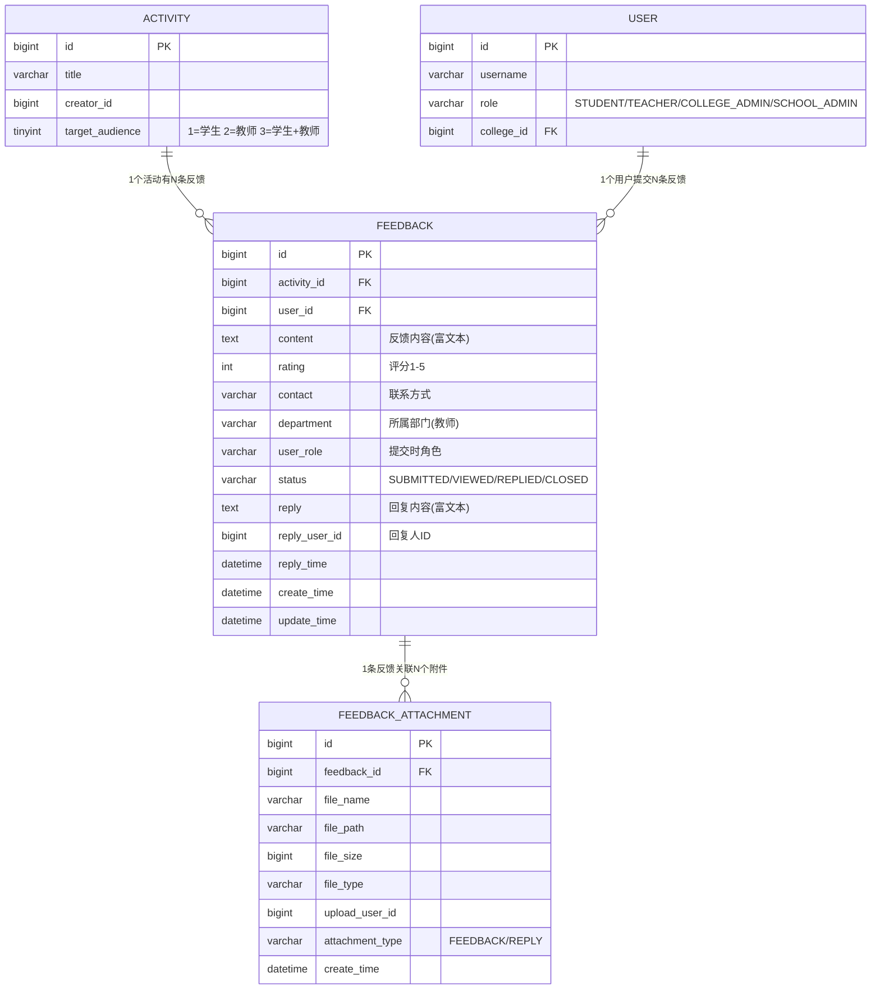
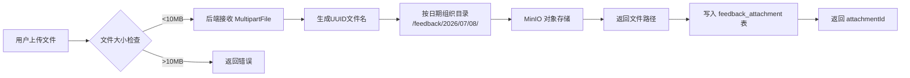

# 活动反馈收集模块 — 需求分析报告

> **经办人**：邹宇健  
> **所属项目**：招生宣传报名平台 (XJU202623)  
> **模块类型**：史诗级 (Epic)  
> **关联任务**：4 个用户故事 + 4 个 API 接口  
> **报告日期**：2026-07-08

---

## 目录

1. [模块定位与经办范围](#1-模块定位与经办范围)
2. [Jira 任务拆解](#2-jira-任务拆解)
3. [业务流程分析](#3-业务流程分析)
4. [API 接口详细设计](#4-api-接口详细设计)
5. [数据库设计](#5-数据库设计)
6. [前端页面设计](#6-前端页面设计)
7. [技术实现要点](#7-技术实现要点)
8. [开发排期](#8-开发排期)

---

## 1. 模块定位与经办范围

### 1.1 系统全局视图



### 1.2 经办范围

你（邹宇健）在本次项目中负责**活动反馈收集模块**完整闭环，包括：

| 维度 | 内容 |
|------|------|
| **史诗** | 活动反馈收集模块 |
| **故事 × 4** | 学生/教师提交反馈、学院/学校查看反馈、反馈回复、附件上传下载 |
| **API × 4+** | 8号~11号接口，以及隐含的回复接口和附件接口 |
| **数据表 × 2** | feedback（反馈主表）、feedback_attachment（附件表） |
| **页面 × 6** | 学生端提交页、教师端提交页、学院端列表页、学校端列表页、反馈详情/回复页、附件管理 |



---

## 2. Jira 任务拆解

### 2.1 Story 1：学生/教师提交反馈

| 字段 | 内容 |
|------|------|
| **Jira 编号** | Story-3 |
| **史诗** | 活动反馈收集模块 |
| **用户角色** | 已报名参加活动的学生 / 教师 |
| **功能描述** | 对已参加的活动提交反馈评价（评分 + 文字 + 联系方式） |
| **验收标准** | 1. 仅已报名且审批通过的用户可提交 2. 评分 1-5 分 3. 内容支持富文本 4. 每人每活动限提交一次 |
| **对应 API** | #8 POST /api/feedback/student 、 #9 POST /api/feedback/teacher |

**前置条件**：



### 2.2 Story 2：学院/学校查看反馈

| 字段 | 内容 |
|------|------|
| **Jira 编号** | Story-4 |
| **史诗** | 活动反馈收集模块 |
| **用户角色** | 学院管理员 / 学校管理员 |
| **功能描述** | 按管辖范围查看反馈列表，支持多条件筛选和分页 |
| **验收标准** | 1. 学院端仅看管辖学院数据 2. 学校端看全校数据 3. 支持按活动、状态筛选 4. 分页查询 |
| **对应 API** | #10 GET /api/feedback/college 、 #11 GET /api/feedback/school |

### 2.3 Story 3：反馈回复

| 字段 | 内容 |
|------|------|
| **Jira 编号** | Story-1 |
| **史诗** | 活动反馈收集模块 |
| **用户角色** | 学院管理员 / 学校管理员 |
| **功能描述** | 查看本学院或全校反馈列表，对反馈进行回复，实现闭环管理 |
| **验收标准** | 1. 回复后反馈状态流转为"已回复" 2. 回复内容支持富文本 3. 学生/教师可在"已报名活动"中查看回复 |
| **对应 API** | 待补充：POST /api/feedback/{id}/reply |

### 2.4 Story 4：附件上传与下载

| 字段 | 内容 |
|------|------|
| **Jira 编号** | Story-5 |
| **史诗** | 活动反馈收集模块 |
| **用户角色** | 学院管理员 / 学校管理员 |
| **功能描述** | 在反馈管理中上传附件（处理凭证、截图等）并支持下载，留痕追溯 |
| **验收标准** | 1. 支持 PDF/Word/Excel/图片 2. 单文件 ≤ 10MB 3. 下载权限校验 |
| **对应 API** | 待补充：POST /api/feedback/attachment/upload 、 GET /api/feedback/attachment/download/{id} |

---

## 3. 业务流程分析

### 3.1 反馈提交流程（学生/教师）



### 3.2 反馈查看与回复流程（学院/学校管理员）



### 3.3 反馈状态流转



---

## 4. API 接口详细设计

### 4.1 接口全景

| 编号 | 方法 | 路径 | 功能 | 角色 | Jira 故事 |
|------|------|------|------|------|-----------|
| 8 | POST | /api/feedback/student | 学生提交反馈 | 学生 | Story 1 |
| 9 | POST | /api/feedback/teacher | 教师提交反馈 | 教师 | Story 1 |
| 10 | GET | /api/feedback/college | 学院端查看反馈列表 | 学院管理员 | Story 2 |
| 11 | GET | /api/feedback/school | 学校端查看反馈列表 | 学校管理员 | Story 2 |
| 📌 | POST | /api/feedback/{id}/reply | 管理员回复反馈 | 学院/学校管理员 | Story 3 |
| 📌 | GET | /api/feedback/{id}/detail | 反馈详情（含附件） | 全角色 | Story 2/3 |
| 📌 | POST | /api/feedback/attachment/upload | 上传附件 | 学院/学校管理员 | Story 4 |
| 📌 | GET | /api/feedback/attachment/download/{id} | 下载附件 | 全角色 | Story 4 |

> 📌 = 根据 Jira 任务新增的接口（原 API 表中隐含但未列出）

### 4.2 接口详细定义

#### 接口 #8 — 学生提交反馈

```
POST /api/feedback/student
Content-Type: application/json
Authorization: Bearer {token}
```

**请求体：**

```json
{
  "activityId": 10001,
  "content": "本次活动组织得非常棒，我学到了很多招生宣传的技巧...",
  "rating": 5,
  "contact": "13800138000"
}
```

| 参数 | 类型 | 必填 | 说明 |
|------|------|------|------|
| activityId | Long | ✅ | 活动ID |
| content | String | ✅ | 反馈文字内容（支持富文本 HTML） |
| rating | Integer | ❌ | 评分 1-5 |
| contact | String | ❌ | 联系方式（手机号/邮箱） |

**响应：**

```json
{
  "code": 200,
  "message": "反馈提交成功",
  "data": {
    "feedbackId": 50001,
    "status": "SUBMITTED"
  }
}
```

**错误码：**

| code | 场景 |
|------|------|
| 400 | 参数校验失败（content 为空、rating 超出 1-5） |
| 403 | 该用户未报名该活动/报名未审批通过 |
| 409 | 该用户已对该活动提交过反馈 |

---

#### 接口 #9 — 教师提交反馈

```
POST /api/feedback/teacher
Content-Type: application/json
Authorization: Bearer {token}
```

**请求体：**

```json
{
  "activityId": 10001,
  "content": "作为带队教师，本次招生活动总体顺利，建议后续增加宣传物料...",
  "rating": 4,
  "contact": "zhang@whut.edu.cn",
  "department": "计算机科学与技术学院"
}
```

| 参数 | 类型 | 必填 | 说明 |
|------|------|------|------|
| activityId | Long | ✅ | 活动ID |
| content | String | ✅ | 反馈文字内容 |
| rating | Integer | ❌ | 评分 1-5 |
| contact | String | ❌ | 联系方式 |
| department | String | ❌ | 所属学院/部门 |

> **与 #8 的差异**：教师多一个 `department` 字段，方便招生办按院系统计教师反馈。

---

#### 接口 #10 — 学院端查看反馈列表

```
GET /api/feedback/college?activityId=10001&status=SUBMITTED&page=1&size=20
Authorization: Bearer {token}
```

**请求参数：**

| 参数 | 类型 | 必填 | 说明 |
|------|------|------|------|
| activityId | Long | ❌ | 按活动筛选 |
| status | String | ❌ | PENDING / SUBMITTED / REPLIED / CLOSED |
| page | Integer | ❌ | 页码（默认 1） |
| size | Integer | ❌ | 每页条数（默认 20，最大 100） |

**响应：**

```json
{
  "code": 200,
  "message": "success",
  "data": {
    "list": [
      {
        "feedbackId": 50001,
        "userId": 2021001,
        "userName": "张三",
        "userRole": "STUDENT",
        "content": "本次活动组织得非常棒...",
        "rating": 5,
        "status": "SUBMITTED",
        "reply": null,
        "attachmentCount": 0,
        "createTime": "2026-07-08 14:30:00"
      }
    ],
    "total": 156,
    "page": 1,
    "size": 20
  }
}
```

> **数据权限**：后端根据当前登录用户的 `collegeId`（管辖学院）自动过滤，仅返回本学院相关的反馈。

---

#### 接口 #11 — 学校端查看反馈列表

```
GET /api/feedback/school?activityId=10001&collegeId=3&status=SUBMITTED&page=1&size=20
```

| 参数 | 类型 | 必填 | 说明 |
|------|------|------|------|
| activityId | Long | ❌ | 按活动筛选 |
| collegeId | Long | ❌ | 按学院筛选（学校端专属） |
| status | String | ❌ | 按状态筛选 |
| page | Integer | ❌ | 页码 |
| size | Integer | ❌ | 每页条数 |

**响应**（比 #10 多一个 `college` 字段）：

```json
{
  "code": 200,
  "data": {
    "list": [
      {
        "feedbackId": 50001,
        "userId": 2021001,
        "userName": "张三",
        "userRole": "STUDENT",
        "college": "计算机科学与技术学院",
        "content": "本次活动组织得非常棒...",
        "rating": 5,
        "status": "SUBMITTED",
        "reply": null,
        "attachmentCount": 2,
        "createTime": "2026-07-08 14:30:00"
      }
    ],
    "total": 520,
    "page": 1,
    "size": 20
  }
}
```

> **数据权限**：学校端可查全校数据，支持按学院筛选。

---

#### 📌 新增接口 — 管理员回复反馈

```
POST /api/feedback/{feedbackId}/reply
Content-Type: application/json
Authorization: Bearer {token}
```

**请求体：**

```json
{
  "replyContent": "感谢你的反馈，你提出的建议我们已记录，将在后续活动中改进。",
  "attachmentIds": [6001, 6002]
}
```

**前置校验规则：**



---

#### 📌 新增接口 — 附件上传

```
POST /api/feedback/attachment/upload
Content-Type: multipart/form-data
Authorization: Bearer {token}
```

| 参数 | 类型 | 必填 | 说明 |
|------|------|------|------|
| file | File | ✅ | 文件（≤10MB） |
| feedbackId | Long | ❌ | 关联的反馈ID（回复时上传） |

**允许的文件类型：**

| 类型 | 扩展名 |
|------|--------|
| PDF | .pdf |
| Word | .doc, .docx |
| Excel | .xls, .xlsx |
| 图片 | .jpg, .jpeg, .png, .gif |
| 视频 | .mp4, .avi, .mov（≤50MB） |

**响应：**

```json
{
  "code": 200,
  "data": {
    "attachmentId": 6001,
    "fileName": "处理凭证_20260708.pdf",
    "filePath": "/feedback/2026/07/08/uuid_abc123.pdf",
    "fileSize": 204800,
    "fileType": "application/pdf"
  }
}
```

---

#### 📌 新增接口 — 附件下载

```
GET /api/feedback/attachment/download/{attachmentId}
Authorization: Bearer {token}
```

**响应**：文件流（`Content-Disposition: attachment`）

**权限校验**：
- 附件上传者本人可下载
- 同一活动的报名人员可下载
- 管辖范围内的管理员可下载

---

## 5. 数据库设计

### 5.1 ER 关系图



### 5.2 建表 SQL

```sql
-- 反馈主表
CREATE TABLE feedback (
    id              BIGINT PRIMARY KEY AUTO_INCREMENT,
    activity_id     BIGINT      NOT NULL COMMENT '活动ID',
    user_id         BIGINT      NOT NULL COMMENT '提交人ID',
    user_role       VARCHAR(20) NOT NULL COMMENT '提交时角色: STUDENT/TEACHER',
    content         TEXT        NOT NULL COMMENT '反馈内容(支持富文本HTML)',
    rating          TINYINT     DEFAULT NULL COMMENT '评分 1-5',
    contact         VARCHAR(100) DEFAULT NULL COMMENT '联系方式',
    department      VARCHAR(100) DEFAULT NULL COMMENT '所属学院/部门(教师填写)',
    status          VARCHAR(20) NOT NULL DEFAULT 'SUBMITTED'
                    COMMENT '状态: SUBMITTED/VIEWED/REPLIED/CLOSED',
    reply           TEXT        DEFAULT NULL COMMENT '管理员回复内容',
    reply_user_id   BIGINT      DEFAULT NULL COMMENT '回复人ID',
    reply_time      DATETIME    DEFAULT NULL COMMENT '回复时间',
    create_time     DATETIME    DEFAULT CURRENT_TIMESTAMP,
    update_time     DATETIME    DEFAULT CURRENT_TIMESTAMP ON UPDATE CURRENT_TIMESTAMP,
    
    INDEX idx_activity_id (activity_id),
    INDEX idx_user_id (user_id),
    INDEX idx_status (status),
    INDEX idx_create_time (create_time),
    UNIQUE KEY uk_user_activity (user_id, activity_id)
) COMMENT '活动反馈表';

-- 反馈附件表
CREATE TABLE feedback_attachment (
    id              BIGINT PRIMARY KEY AUTO_INCREMENT,
    feedback_id     BIGINT      NOT NULL COMMENT '关联反馈ID',
    file_name       VARCHAR(255) NOT NULL COMMENT '原始文件名',
    file_path       VARCHAR(500) NOT NULL COMMENT '存储路径',
    file_size       BIGINT      DEFAULT 0 COMMENT '文件大小(字节)',
    file_type       VARCHAR(50)  DEFAULT NULL COMMENT 'MIME类型',
    upload_user_id  BIGINT      NOT NULL COMMENT '上传人ID',
    attachment_type VARCHAR(20)  NOT NULL DEFAULT 'FEEDBACK'
                    COMMENT '附件类型: FEEDBACK(反馈附件)/REPLY(回复附件)',
    create_time     DATETIME    DEFAULT CURRENT_TIMESTAMP,
    
    INDEX idx_feedback_id (feedback_id),
    INDEX idx_upload_user_id (upload_user_id),
    FOREIGN KEY (feedback_id) REFERENCES feedback(id) ON DELETE CASCADE
) COMMENT '反馈附件表';
```

### 5.3 关键索引策略

| 索引名 | 字段 | 用途 |
|--------|------|------|
| `uk_user_activity` | (user_id, activity_id) | 保证一人一活动只能提交一条反馈 |
| `idx_activity_id` | activity_id | 按活动查询反馈列表 |
| `idx_status` | status | 按状态筛选（待处理/已回复等） |
| `idx_create_time` | create_time | 按时间排序、归档查询 |

---

## 6. 前端页面设计

### 6.1 页面清单

| 序号 | 页面名称 | 端口 | 用户角色 | 核心组件 |
|------|----------|------|----------|----------|
| P1 | 反馈提交页 | 学生端(H5) | 学生 | 星级评分、富文本编辑器、联系方式输入 |
| P2 | 反馈提交页 | 教师端(PC) | 教师 | 同上 + 所属院系选择 |
| P3 | 反馈管理列表 | 学院端(PC) | 学院管理员 | 筛选栏、数据表格、状态标签 |
| P4 | 反馈管理列表 | 学校端(PC) | 学校管理员 | 同上 + 学院筛选 |
| P5 | 反馈详情/回复弹窗 | 学院/学校端 | 管理员 | 反馈原文、回复编辑器、附件上传 |
| P6 | 我的反馈查看 | 学生/教师端 | 学生/教师 | 反馈内容、回复内容、状态时间线 |

### 6.2 页面布局示意

#### P1/P2 — 反馈提交页

```
┌──────────────────────────────────────────┐
│  活动反馈 — 「2026年寒假招生宣传活动」      │
│                                          │
│  ┌──────────────────────────────────────┐│
│  │  活动评分                             ││
│  │  ★★★★☆  (4分)                        ││
│  └──────────────────────────────────────┘│
│                                          │
│  ┌──────────────────────────────────────┐│
│  │  反馈内容 *                           ││
│  │  ┌────────────────────────────────┐  ││
│  │  │ B  I  U  H1  H2  🔗  🖼  📎   │  ││
│  │  ├────────────────────────────────┤  ││
│  │  │                                │  ││
│  │  │  请输入您的活动反馈...           │  ││
│  │  │                                │  ││
│  │  │                                │  ││
│  │  └────────────────────────────────┘  ││
│  └──────────────────────────────────────┘│
│                                          │
│  ┌──────────────────────────────────────┐│
│  │  联系方式（选填）                     ││
│  │  ┌──────────────────────────────┐    ││
│  │  │  手机号 / 邮箱                 │    ││
│  │  └──────────────────────────────┘    ││
│  └──────────────────────────────────────┘│
│                                          │
│  ┌──────────────────────────────────────┐│
│  │  所属院系（教师填写）                  ││
│  │  ┌──────────────────────────────┐    ││
│  │  │  计算机科学与技术学院           │    ││
│  │  └──────────────────────────────┘    ││
│  └──────────────────────────────────────┘│
│                                          │
│              [ 提交反馈 ]                 │
└──────────────────────────────────────────┘
```

#### P3/P4 — 反馈管理列表

```
┌──────────────────────────────────────────────────────────────┐
│  反馈管理                                                     │
│                                                              │
│  活动: [全部活动 ▼]  状态: [全部状态 ▼]  学院: [全部学院 ▼]   │
│  搜索: [________________] 🔍                                 │
│                                                              │
│  ┌──────┬────────┬──────────┬──────┬──────┬──────┬────────┐  │
│  │ 编号 │ 提交人  │  所属学院  │ 评分  │ 状态  │ 时间  │ 操作   │  │
│  ├──────┼────────┼──────────┼──────┼──────┼──────┼────────┤  │
│  │50001 │ 张三    │ 计算机学院 │ ★★★★ │ 已提交│07-08 │ 查看   │  │
│  │50002 │ 李四    │ 信息学院   │ ★★★  │ 已回复│07-08 │ 查看   │  │
│  │50003 │ 王五    │ 计算机学院 │ ★★★★★│ 已提交│07-07 │ 查看   │  │
│  └──────┴────────┴──────────┴──────┴──────┴──────┴────────┘  │
│                                                              │
│  共 156 条记录               < 1  2  3  4  5 ... 8 >         │
└──────────────────────────────────────────────────────────────┘
```

#### P5 — 反馈详情/回复弹窗

```
┌────────────────────────────────────────────────┐
│  反馈详情 — #50001                         [✕] │
│                                                │
│  ┌─ 提交人信息 ──────────────────────────────┐ │
│  │  姓名: 张三    角色: 学生                    │ │
│  │  学院: 计算机科学与技术学院                  │ │
│  │  活动: 2026年寒假招生宣传活动               │ │
│  │  提交时间: 2026-07-08 14:30                │ │
│  └────────────────────────────────────────────┘ │
│                                                │
│  ┌─ 反馈内容 ────────────────────────────────┐ │
│  │  本次活动组织得非常棒，我学到了很多...        │ │
│  │  评分: ★★★★☆ (4/5)                        │ │
│  │  联系方式: 13800138000                     │ │
│  └────────────────────────────────────────────┘ │
│                                                │
│  ┌─ 管理回复 ────────────────────────────────┐ │
│  │  ┌──────────────────────────────────────┐  │ │
│  │  │ B  I  U  H1  🔗  🖼  📎   [上传附件] │  │ │
│  │  ├──────────────────────────────────────┤  │ │
│  │  │                                      │  │ │
│  │  │  请输入回复内容...                     │  │ │
│  │  └──────────────────────────────────────┘  │ │
│  │                                          │  │ │
│  │  已上传附件:                               │  │ │
│  │  📎 处理凭证_20260708.pdf (200KB) [删除]   │  │ │
│  └────────────────────────────────────────────┘ │
│                                                │
│              [ 提交回复 ]  [ 关闭 ]              │
└────────────────────────────────────────────────┘
```

---

## 7. 技术实现要点

### 7.1 后端代码结构

```
enrollment-modules/module-feedback/
├── controller/
│   ├── FeedbackStudentController.java    # 接口 #8
│   ├── FeedbackTeacherController.java    # 接口 #9
│   ├── FeedbackCollegeController.java    # 接口 #10
│   ├── FeedbackSchoolController.java     # 接口 #11
│   └── FeedbackAttachmentController.java # 附件上传/下载
├── service/
│   ├── FeedbackService.java              # 反馈核心业务
│   ├── FeedbackReplyService.java         # 回复业务
│   └── AttachmentService.java            # 附件管理
├── mapper/
│   ├── FeedbackMapper.java               # 反馈表 Mapper
│   └── FeedbackAttachmentMapper.java     # 附件表 Mapper
├── entity/
│   ├── Feedback.java
│   └── FeedbackAttachment.java
├── dto/
│   ├── FeedbackSubmitRequest.java        # 提交反馈请求体
│   ├── FeedbackReplyRequest.java         # 回复请求体
│   ├── FeedbackListQuery.java            # 列表查询参数
│   └── FeedbackVO.java                   # 列表返回视图对象
└── enums/
    ├── FeedbackStatus.java               # SUBMITTED/VIEWED/REPLIED/CLOSED
    └── AttachmentType.java               # FEEDBACK/REPLY
```

### 7.2 关键 Service 逻辑

```java
// FeedbackService.submit() 核心校验逻辑
public FeedbackVO submit(FeedbackSubmitRequest req, Long userId) {
    // 1. 校验活动是否存在、是否允许反馈
    Activity activity = activityService.getById(req.getActivityId());
    Assert.notNull(activity, "活动不存在");
    
    // 2. 校验用户是否已报名且审批通过
    Enrollment enrollment = enrollmentService.getByUserAndActivity(userId, req.getActivityId());
    Assert.notNull(enrollment, "您未报名该活动");
    Assert.isTrue("APPROVED".equals(enrollment.getStatus()), "报名未审批通过，无法提交反馈");
    
    // 3. 校验是否已提交过反馈（UNIQUE KEY 兜底）
    Feedback existing = lambdaQuery()
        .eq(Feedback::getUserId, userId)
        .eq(Feedback::getActivityId, req.getActivityId())
        .one();
    Assert.isNull(existing, "您已提交过该活动的反馈");
    
    // 4. 校验活动面向人群（target_audience）
    String userRole = currentUser.getRole();
    if ("STUDENT".equals(userRole) && activity.getTargetAudience() == 2) {
        throw new BizException("该活动仅面向教师反馈");
    }
    
    // 5. 写入数据库
    Feedback feedback = Feedback.builder()
        .activityId(req.getActivityId())
        .userId(userId)
        .userRole(userRole)
        .content(req.getContent())
        .rating(req.getRating())
        .contact(req.getContact())
        .status(FeedbackStatus.SUBMITTED)
        .build();
    save(feedback);
    
    return FeedbackVO.from(feedback);
}
```

### 7.3 文件存储方案



**文件名校验（防止路径穿越）：**

```java
public String sanitizeFileName(String originalName) {
    String ext = FilenameUtils.getExtension(originalName);
    if (!ALLOWED_EXTENSIONS.contains(ext.toLowerCase())) {
        throw new BizException("不支持的文件类型: " + ext);
    }
    return UUID.randomUUID().toString() + "." + ext;
}
```

### 7.4 数据权限实现

```java
// 学院端：仅查看本学院管辖的反馈
// FeedbackCollegeController
public PageResult<FeedbackVO> list(FeedbackListQuery query) {
    Long currentCollegeId = SecurityUtils.getCurrentUser().getCollegeId();
    
    LambdaQueryWrapper<Feedback> wrapper = new LambdaQueryWrapper<>();
    wrapper.eq(Feedback::getActivityId, query.getActivityId());
    wrapper.eq(query.getStatus() != null, Feedback::getStatus, query.getStatus());
    
    // 关键：关联用户表，过滤本学院
    wrapper.inSql(Feedback::getUserId,
        "SELECT id FROM sys_user WHERE college_id = " + currentCollegeId);
    
    wrapper.orderByDesc(Feedback::getCreateTime);
    
    IPage<Feedback> page = feedbackMapper.selectPage(
        new Page<>(query.getPage(), query.getSize()), wrapper);
    
    return PageResult.from(page, FeedbackVO::from);
}
```

### 7.5 关键难点与对策

| 难点 | 对策 |
|------|------|
| **富文本 XSS 防护** | 后端使用 Jsoup 白名单过滤，仅允许安全标签（b, i, p, br, ul, ol, li, a[href]） |
| **大文件上传超时** | 前端分片上传（slice upload），后端合并；MinIO 直传预签名 URL |
| **高并发下 UNIQUE KEY 冲突** | 数据库唯一索引 + 应用层乐观锁 + 友好错误提示 |
| **附件下载权限** | 统一的"数据权限切面"，基于注解 `@DataScope(type = FEEDBACK)` 自动校验 |
| **反馈状态一致** | 状态流转使用状态机模式（State Pattern），杜绝非法状态跳跃 |

---

## 8. 开发排期

| 阶段 | 时间 | 任务 | 交付物 |
|------|------|------|--------|
| **设计** | 第1周 | 数据库设计 + API 接口评审 + 前端原型 | ER图、接口文档、页面线框图 |
| **后端开发** | 第2-3周 | 4个已有接口 + 4个新增接口 + 单元测试 | 完整 Controller/Service/Mapper |
| **前端开发** | 第3-4周 | H5 反馈提交页 + PC 反馈管理页 + 详情弹窗 | 6个页面/组件 |
| **联调** | 第5周 | 前后端联调 + 文件上传联调 + 权限测试 | 联调报告 |
| **测试** | 第6周 | 功能测试 + 边界测试 + 性能测试 | 测试用例 + Bug修复 |
| **交付** | 第7周 | 集成到主项目 + 接口文档更新 + 演示 | 可上线状态 |

---

> **文档版本**: v1.0  
> **编写人**: 邹宇健(经办)  
> **审核人**: 待指定  
> **文档状态**: 待评审
